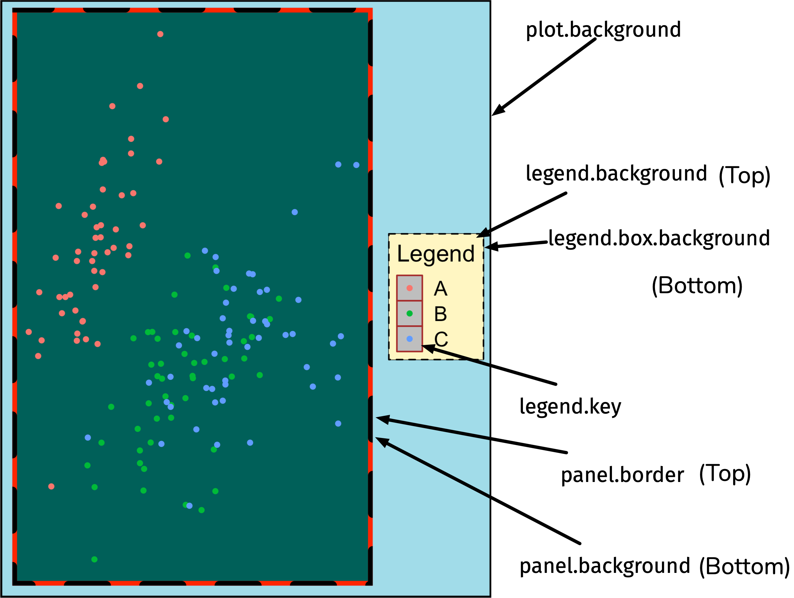

```{r, include = FALSE}
library(RColorBrewer)
library(flair)
library(kableExtra)
safe_col <- c("Paired", "BrBG", "PiYG", "PRGn", "PuOr", "RdBu", "RdYlBu")
my_col <- brewer.pal(4,  safe_col[6])
current_file <- knitr::current_input()
flair_on <- TRUE
```

```{r external, child="setup.Rmd", include=FALSE}
```

# Thanks to

- **Functional Programming** by Sara Altman, Bill Behrman and Hadley Wickham
  - .monash-blue[https://github.com/dcl-docs/prog]
- **Tidyverse + R Markdown Workshop** by Emi Tanaka
  - .monash-blue[https://github.com/emitanaka/biometrics2019]
- **Data Wrangling with R Workshop** by Emi Tanaka
  - .monash-blue[https://github.com/emitanaka/datawrangle-workshop-ssavic]

These slides are licensed under:

.center[
<a href="https://creativecommons.org/licenses/by-nc-sa/4.0/">
<br>
]


---

# About me

- Masatoshi Katabuchi

- Plant Ecologist @ Xishuangbanna Tropical Botanical Garden

- Interests:
  - Data <i class="fas fa-chart-line"></i> |
    Leaf <i class="fas fa-leaf"></i> |
    Beer <i class="fas fa-beer"></i> <i class="fas fa-beer"></i> <i class="fas fa-beer"></i>
<br>
<br>
<br>
`r anicon::faa("envelope", animate=NULL)`  `r rmarkdown::metadata$email` |
`r anicon::faa("twitter", animate=NULL, speed="fast")` `r rmarkdown::metadata$twitter` |
`r anicon::faa("globe", animate=NULL, speed="fast")` https://mattocci27.github.io


---

class: font_smaller

# Goal : using this data, make the plot below

```{r, include=FALSE}
dat <- read_csv("./data/leaf_data.csv")


dat 


knitr::opts_chunk$set(
  fig.path = "figure/"
)
```

```{r leaf-data}
glimpse(dat)
```

```{r plot1, echo = FALSE, fig.width = 15, fig.height = 4}

my_col <- brewer.pal(3, "Dark2")
#brewer.pal(3, "Paired") |> show_col()
#brewer.pal(3, "Dark2") |> show_col()

dat |>
  filter(!is.na(DE)) |>
  mutate(Narea = LMA * Nmass * 10^-2) |>
  mutate(Rdarea = LMA * Rdmass * 10^-3) |>
  dplyr::select(-Nmass, -Rdmass) |>
  pivot_longer(cols = LMA:Rdarea) |>
  mutate(`Leaf habit` = ifelse(DE == "D", "Deciduous", "Evergreen")) |>
  mutate(`Leaf habit` = factor(`Leaf habit`, levels = c("Evergreen", "Deciduous"))) |>
  mutate(name = factor(name, 
                       levels = c("LMA", "Narea", "Aarea", "Rdarea"),
                       labels = c("LMA~(g~m^{-2})", "N[area]~(g~cm^{-2})", 
                                  "A[area]~(mu*mol~m^{-2}~s^{-1})", 
                                  "Rd[area]~(mu*mol~m^{-2}~s^{-1})")
                       )) |>
  ggplot(aes(x = value, fill = `Leaf habit`)) +
  geom_histogram(position = "identity", alpha = 0.6, aes(col = `Leaf habit`)) +
  scale_color_manual(values = my_col[1:2]) +
  scale_fill_manual(values = my_col[1:2]) +
  facet_wrap(~ name, scale = "free", 
             labeller = label_parsed,
             nrow = 1) +
  xlab("Trait values") +
  ylab("Count") +
  scale_x_log10() +
  theme(strip.text = element_text(size = 16),
        legend.position = "top"
  )

```

.footnote[
Wright et al. 2004. “The worldwide leaf economics spectrum” Nature 428:821–827
]

---

#  Basic structure of ggplot: 3 `r emo::ji("key")` components


.paddings[
<pre><code>
ggplot(.bg-yellow[&lt;data&gt;], aes(x = .bg-yellow[&lt;mappings&gt;])) +
  .bg-yellow[&lt;layer&gt;]()
</code> </pre>
]


::: { .info-box .pos width: 60%; margin-left: 20%; font-size: 24pt; }

1. **data**, 
2. a set of **aesthetic** mappings between variables in the data and visual properties, and
3. at least one **layer** which describes how to render each observation. 

:::


::: footnote
From: Emi Tanaka (2019) Tidyverse + R Markdown Workshop 
:::

---


class: font_smaller

# ggplot

::: grid

::: { .item50 border-right: dashed 3px black}


```{r empty1, include=FALSE, fig.height=3, fig.width=3}
ggplot(data = dat, aes(x = DE))
```

```{r, echo = FALSE, fig.width = 5, fig.height = 5}
decorate("empty1") |>
  flair("data", background = "#2196F3") |>
  flair("aes", background = "#FF9800") |>
  knit_print.with_flair()
```


```{r empty2, include = FALSE, fig.height=3, fig.width=4}
ggplot(data = dat, aes(x = DE, y = LMA))
```

```{r, echo = FALSE, fig.width = 6, fig.height = 5}
decorate("empty2") |>
  flair("data", background = "#2196F3") |>
  flair("aes", background = "#FF9800") |>
  knit_print.with_flair()
```

:::

::: item

- We only specify the .blue[data] and .orange[mappings], so only empty plots will show up. 

--

- Let's add some layers!

:::

:::


---

# Example layers: geom_xxx()

```{r}
p <- ggplot(dat, aes(x = DE, y = LMA))
```

::: grid 

::: item 

```{r, fig.height = 4, fig.width = 4}
p + geom_violin()
```

:::

::: item 

```{r boxplot, fig.height = 4, fig.width = 4}
p + geom_boxplot()
```

:::

::: item 

```{r, fig.height = 4, fig.width = 4}
p + geom_point()
```

:::

:::

---

# So many geom!

.center[

]

---

# Layer system: geom_point()

The `<layer>` contains 1) geometric object, 2) statistical transformation, and
3) position adjustment.

```{r, eval=FALSE, fig.height=3.5, fig.width=3.5}
ggplot(dat, aes(x = LMA, y = Aarea)) +
  layer(geom = "point",
        stat = "identity",
        position = "identity"
  )
```

--

can be simply written using `geom_xxx`

```{r, eval=FALSE, fig.height=3.5, fig.width=3.5}
ggplot(dat, aes(x = LMA, y = Aarea)) +
  geom_point()
```

---

class: font_smaller

# layer: statistical transformation

```{r hist, eval=FALSE, echo=FALSE}
ggplot(dat, aes(x = LMA)) + geom_histogram()
```

```{r}
p <- ggplot(dat, aes(x = LMA)) + geom_histogram()
```

::: { .grid grid: 1fr / 300px 900px; } 

::: item 

```{r hist, echo = FALSE, fig.height = 4, fig.width = 4}
```

<p></p>

:::

::: item 
* Both x-y axes are not the raw data.
* `geom_histogram` uses `stat = "bin"`.
* It is plotting a statistical transformation of the `x-y` values. 

```{r}
dat |> pull(LMA) |> head(5)
layer_data(p, 1) |> head(5)
```
<p></p>

:::

:::


---

class: font_smaller

# layer: position

```{r}
p <- ggplot(dat, aes(x = LMA, fill = DE))
```

::: grid 

::: item 

```{r, fig.height = 4, fig.width = 6}
p + 
  geom_histogram()
```

:::

::: item 

```{r, fig.height = 4, fig.width = 6}
p + 
  geom_histogram(position = "identity", alpha = 0.6)
```

:::

:::

---

# layer: adding multiple layers

::: grid font_smaller

::: item 

Each layer inherits mapping and data from `ggplot` by default.  


```{r plot_m, eval=FALSE}
ggplot(data = dat, aes(x = DE, y = LMA)) +
  geom_violin() + 
  geom_boxplot() + 
  geom_point()
```
<p></p>

::: 

::: item 

```{r plot_m, echo = FALSE, fig.height = 4, fig.width = 4}
```

::: 

:::

---

# layer: order matters


::: { .grid .font_smaller grid: 250px 250px / 1fr 1fr; }

::: item 

```{r plot1a, eval=FALSE}
ggplot(data = dat, aes(x = DE, y = LMA)) +
  geom_violin() + #<<
  geom_boxplot() + #<<
  geom_point()
```

::: 

::: item 

```{r plot1a, echo = FALSE, fig.height = 3, fig.width = 4}
```

::: 

::: item 

```{r plot1b, eval=FALSE}
ggplot(data = dat, aes(x = DE, y = LMA)) +
  geom_boxplot() + #<<
  geom_violin() + #<<
  geom_point()
```


::: 

::: item 

```{r plot1b, echo = FALSE, fig.height = 3, fig.width = 4}
```

::: 

:::

---

class: font_smaller

# layer: layer-specific data

::: grid

::: item 

For each layer, aesthestic and/or data can be overwritten.

```{r plot2, eval=FALSE}
ggplot(dat, aes(DE, LMA)) +
  geom_violin(aes(fill = DE)) +
  geom_boxplot(data = filter(dat, !is.na(DE))) +
  geom_point(data = filter(dat, !is.na(DE)),
             aes(y = LMA))
```


:::

::: item


```{r plot2, echo = FALSE, fig.width = 5, fig.height = 4.5}
```


:::

:::


---

# Full components of `ggplot` object

::: grid
::: { .item border-right: dashed 3pt black; }

.font_smaller[
```{r}
p <- ggplot(dat, aes(x = DE, y = LMA))
names(p) |> as.data.frame()
```

<br>

Data, mapping, and layers are required.
]


:::

::: item

.font_smaller[
We can specify 5 more components (optional)

```{r, echo=FALSE}

tmp <- c("scale of axes, colors, sizes...",
         "theme of titles, labels, fonts, background, gridlines, and legends",
         "coordinate systems (e.g., axis limits)",
         "lay out panels",
         "modify axis, legend and plot labels"
)

tibble(component = names(p)) |>
  filter(component %in% c("scales", "theme", 
                          "coordinates", "facet", "labels")) |>
  mutate(Description = tmp) |>
  kable() |>
  kable_styling()
```

]


:::

---

class: font_smaller

# Scales


* Scales control the mapping from .blue[data] to .blue[aesthetics]. 

scale\_.bg-yellow[&lt;aesthetics&gt;]\_.bg-yellow[&lt;type&gt;]

```{r}
p <- ggplot(dat |> filter(!is.na(Aarea)), aes(x = LMA, y = Nmass, col = Aarea)) + geom_point()
```

::: grid 

::: item 
```{r scale1, fig.height = 3.5, fig.width = 4}
p + scale_y_continuous() +
  scale_x_continuous()
```

::: 

::: item 

```{r scale2, fig.height = 3.5, fig.width = 4}
p + scale_x_reverse() +
  scale_y_continuous(trans="log10")
```

::: 

::: item 

```{r scale3, fig.height = 3.5, fig.width = 4}
p + scale_y_log10() + 
  scale_x_log10()
```


::: 

:::

---

class: font_smaller

# Scales 

* Scales control the mapping from .blue[data] to .blue[aesthetics]. 

scale\_.bg-yellow[&lt;aesthetics&gt;]\_.bg-yellow[&lt;type&gt;]

```{r}
p <- ggplot(dat |> filter(!is.na(Aarea)), aes(x = LMA, y = Nmass, col = Aarea)) + geom_point()
```

::: grid 

::: item 

```{r scale5, fig.height = 3.5, fig.width = 4}
p + scale_y_log10() + scale_x_log10() +
  scale_color_continuous(trans = "log10")
```

::: 

::: item


```{r scale6, fig.height = 3.5, fig.width = 4}
p + scale_y_log10() + scale_x_log10() +
  scale_color_viridis_c(trans = "log10")
```

---


class: font_smaller

# Scales

* Scales control the mapping from .blue[data] to .blue[aesthetics]. 

scale\_.bg-yellow[&lt;aesthetics&gt;]\_.bg-yellow[&lt;type&gt;]


```{r}
p <- ggplot(dat |> filter(!is.na(DE)), 
            aes(x = DE, y = LMA, fill = DE)) + geom_boxplot() + scale_y_log10()
```


::: grid 

::: item 

```{r , fig.height = 3, fig.width = 3}
my_col <- RColorBrewer::brewer.pal(4, "Dark2") 
my_col
my_col|> scales::show_col()
```

::: 

::: item

```{r  fig.height = 3.5, fig.width = 4}
p +  
  scale_fill_manual(values = my_col[1:2])
```

---


class: font_smaller

# Labels

Labels modify axis, legend and plot labels

```{r lab2, include=FALSE, fig.height = 4.5, fig.width = 6.5}
ggplot(dat |> filter(!is.na(Aarea)),
       aes(x = LMA, y = Nmass, col = Aarea)) + geom_point() +
  scale_y_log10() + scale_x_log10() +
  scale_color_continuous(name = expression(A[area]~(u*mol~m^-2~s^1)), 
                         trans = "log10") +
  labs(y = expression(N[mass]~(`%`)), x = expression(LMA~(g~m^-2)),
       title = "Fig. 1") 
```

```{r, echo = FALSE, fig.width = 10, fig.height = 4}
decorate("lab2") |>
  flair("labs") |>
  knit_print.with_flair()
```

---


class: font_smaller

# Faceting

```{r}
p <- dat |> filter(!is.na(DE)) |> ggplot(aes(x = LMA, y = Nmass, col = DE)) + geom_point() +
scale_x_log10() + scale_y_log10()
```

::: { .grid border-top: dashed 3px black; }

::: item 

```{r, fig.width = 5, fig.height = 2.8}
p
```


```{r plot3, fig.width = 7, fig.height = 3}
p + facet_wrap(~DE)
```
<p></p>


:::

::: item


```{r, fig.width = 7, fig.height = 5}
p + facet_grid(cut(log10(LMA), 3) ~ DE)
```

:::

:::

---

class: font_smaller

# Coordinates

- `coord_cartesian` and `x(y)lim` modify axis limits.
-  Note that `x(y)lim` overwrites scale\_x\_<type>.

```{r}
p <- ggplot(dat, aes(x = LMA, y = Nmass, col = DE)) + geom_point() +
scale_x_log10() + scale_y_log10()
```

::: grid 

::: item 

```{r coord1, fig.height = 3.5, fig.width = 4}
p + xlim(30, 300) + 
  ylim(0.3, 3)
```

::: 

::: item

```{r coord2, fig.height = 3.5, fig.width = 4}
p + coord_cartesian(xlim = c(30, 300), 
                    ylim = c(0.3, 3))
```

:::

::: item 

```{r coord3, fig.height = 3.5, fig.width = 4}
p + xlim(0.1, 2000) + 
  ylim(0.1, 10)
```

::: 


::: 

---

class: font_smaller

# Complete themes


```{r}
p <- ggplot(dat, aes(x = LMA, y = Nmass, col = DE)) + geom_point() +
scale_x_log10() + scale_y_log10()
```

::: grid 

::: item 

```{r fig.height = 3.5, fig.width = 4}
p + theme_gray()
```

::: 

::: item

```{r fig.height = 3.5, fig.width = 4}
p + theme_bw()
```

:::

::: item 

```{r fig.height = 3.5, fig.width = 4}
p + theme_classic()
```

::: 


::: 

---

class: center

# `theme`: modify the *look* of texts


.font_large[`element_text()`]

::: footnote
From: Emi Tanaka (2019) Tidyverse + R Markdown Workshop 
:::

---

class: font_small

# `element_text()`


::: { .grid grid: 1fr / 1fr 1fr; }

::: item 

```{r ele-text, eval = F}

ggplot(diamonds, aes(carat, price)) + geom_hex() +
  labs(title = "Diamond") +
  theme(axis.title.x = element_text(size = 30,
                                   color = "red",
                                   face = "bold",
                                   angle = 10),
         legend.title = element_text(size = 25,
                                     color = "#ef42eb", 
                                     margin = margin(b = 5)),
         plot.title = element_text(size = 35,
                                   face = "bold",
                                   color = "blue"
                                  ))

```
<p></p>

::: 

::: item 

```{r ele-text, echo = F, fig.width = 3.8, fig.height = 4.5}
```

<p></p>

:::

:::

::: footnote
From: Emi Tanaka (2019) Tidyverse + R Markdown Workshop 
:::

---

class: center

# `theme`: modify the *look* of the lines


.font_large[`element_line()`]

::: footnote
From: Emi Tanaka (2019) Tidyverse + R Markdown Workshop 
:::

---

class: font_small

# `element_line()`


::: { .grid grid: 1fr / 1fr 1fr; }

::: item 

```{r ele-line, eval = F}
ggplot(iris, aes(Sepal.Length, Sepal.Width)) + geom_point() +
 theme(axis.line.y = element_line(color = "black",
                                  size = 1.2,
                                  arrow = grid::arrow()),
       axis.line.x = element_line(linetype = "dashed", 
                                  color = "brown",
                                  size = 1.2),
       axis.ticks = element_line(color = "red", size = 1.1),
       axis.ticks.length = unit(3, "mm"),
       panel.grid.major = element_line(color = "blue", 
                                       size = 1.2),
       panel.grid.minor = element_line(color = "#0080ff",
                                       size = 1.2,
                                       linetype = "dotted"))
```
<p></p>

::: 

::: item 

```{r ele-line, echo = F, fig.width = 3.2, fig.height = 4.5}
```

<p></p>

:::

:::

::: footnote
From: Emi Tanaka (2019) Tidyverse + R Markdown Workshop 
:::

---

class: center

# `theme`: modify the *look* of the <br>rectangular regions




.font_large[`element_rect()`]

::: footnote
From: Emi Tanaka (2019) Tidyverse + R Markdown Workshop 
:::

---

class: font_small

# `element_line()`


::: { .grid grid: 1fr / 1fr 1fr; }

::: item 

```{r ele-rect, eval = F}
ggplot(iris, aes(Sepal.Length, Sepal.Width)) + 
 geom_point(aes(color = Species)) +
 theme(
  legend.background = element_rect(fill = "#fff6c2", 
                                  color = "black",
                               linetype = "dashed"),
  legend.key = element_rect(fill = "grey", color = "brown"),
  panel.background = element_rect(fill = "#005F59",
                          color = "red", size = 3),
  panel.border = element_rect(color = "black", 
                              fill = "transparent",
                    linetype = "dashed", size = 3),
  plot.background = element_rect(fill = "#a1dce9",
                                color = "black",
                                 size = 1.3),
       legend.position = "bottom")
```
<p></p>

::: 

::: item 

```{r ele-rect, echo = F, fig.width = 3.2, fig.height = 4.5}
```

<p></p>

:::

:::

::: footnote
From: Emi Tanaka (2019) Tidyverse + R Markdown Workshop 
:::


---

class: font_smaller2

# Goal : Data wrangling for visualization

```{r echo = TRUE, fig.width = 15, fig.height = 4}
dat2 <- dat |>
  filter(!is.na(DE)) |>
  mutate(Narea = LMA * Nmass * 10^-2) |>
  mutate(Rdarea = LMA * Rdmass * 10^-3) |>
  dplyr::select(-Nmass, -Rdmass) |>
  pivot_longer(cols = LMA:Rdarea) |>
  mutate(DE = factor(DE, levels = c("E", "D"),
                      labels = c("Evergreen", "Deciduous"))) |>
  mutate(name = factor(name, levels = c("LMA", "Narea", "Aarea", "Rdarea"),
                       labels = c("LMA~(g~m^{-2})", "N[area]~(g~cm^{-2})", 
                                  "A[area]~(mu*mol~m^{-2}~s^{-1})", 
                                  "Rd[area]~(mu*mol~m^{-2}~s^{-1})")))

dat2 |> head()
```

---

class: font_smaller2

# Goal : Visualization

```{r goal, include=FALSE, fig.width = 15, fig.height = 4}
ggplot(data = dat2, aes(x = value, fill = DE, col = DE)) +
  geom_histogram(position = "identity", alpha = 0.6) +
  scale_color_manual(values = my_col[1:2], name = "Leaf habit") +
  scale_fill_manual(values = my_col[1:2], name = "Leaf habit") +
  scale_x_log10() +
  facet_wrap(~ name, scale = "free", 
             labeller = label_parsed, nrow = 1) +
  labs(x = "Trait values", y = "Count") +
  theme(strip.text = element_text(size = 16),
        legend.position = "top")
```

```{r, echo = FALSE, fig.width = 10, fig.height = 4}
decorate("goal") |>
  flair("data") |>
  flair("aes") |>
  flair("scale_x") |>
  flair("scale_color") |>
  flair("scale_fill") |>
  flair("geom") |>
  flair("facet") |>
  flair("labs") |>
  flair("theme") |>
  knit_print.with_flair()
```

---

# Appendix 1: Cheat sheet

.center[

]

---

# Appendix 2: theme used in this slide

```{r}
largefontthm <- theme_bw() + theme(
    axis.title        = element_text(size = 18),
    axis.text         = element_text(size = 16),
    strip.text        = element_text(size = 20),
    plot.title = element_text(size = 22),
    plot.subtitle = element_text(size = 18),
    plot.caption = element_text(size = 14),
    legend.text = element_text(size = 14),
    legend.title = element_text(size = 16)
    )

theme_set(largefontthm)
```

---

# Exercise 1: scatter plot

```{r, echo=FALSE, fig.width = 8, fig.height = 6}
dat |>
  ggplot(aes(x = Nmass, y = Aarea / LMA * 100, col = DE, size = log10(LMA))) +
  geom_point(alpha = 0.6) +
  scale_x_log10() +
  scale_y_log10() +
  largefontthm
```

---

# Exercise 2: density plot

```{r, echo=FALSE, fig.width = 8, fig.height = 6}
dat |>
  ggplot(aes(x = LMA, fill = DE)) +
  geom_density(alpha = 0.6) +
  scale_x_log10() +
  largefontthm
```
