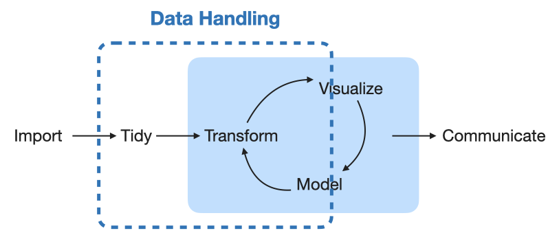
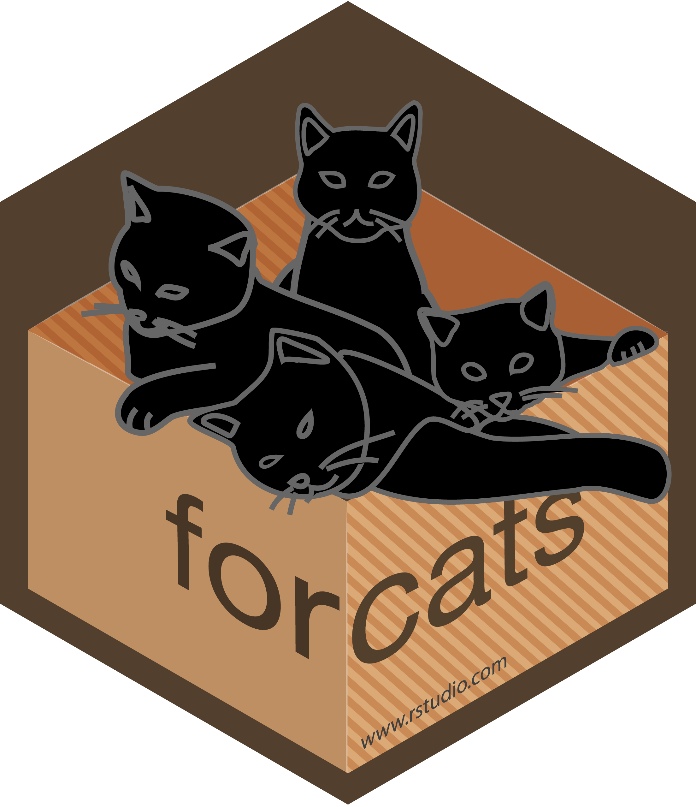
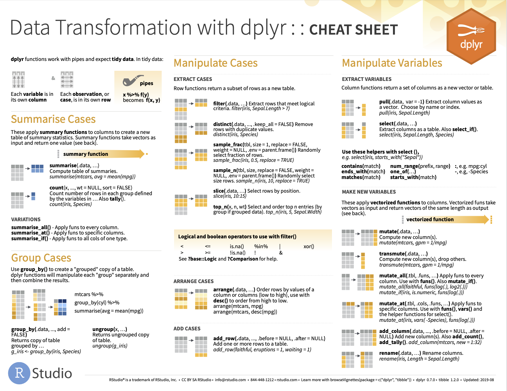

```{r, include = FALSE}
library(RColorBrewer)
library(flair)
safe_col <- c("Paired", "BrBG", "PiYG", "PRGn", "PuOr", "RdBu", "RdYlBu")
my_col <- brewer.pal(4,  safe_col[6])
current_file <- knitr::current_input()
flair_on <- TRUE
```

```{r external, child="setup.Rmd", include=FALSE}
```

# Thanks to

- **Functional Programming** by Sara Altman, Bill Behrman and Hadley Wickham
  - .monash-blue[https://github.com/dcl-docs/prog]
- **Data Wrangling with R Workshop** by Emi Tanaka
  - .monash-blue[https://github.com/emitanaka/biometrics2019]
- **Tidyverse Workshop** by Emi Tanaka
  - .monash-blue[https://github.com/emitanaka/datawrangle-workshop-ssavic]

These slides are licensed under:

.center[
<a href="https://creativecommons.org/licenses/by-nc-sa/4.0/">
<br>
]


---

# About me

- Masatoshi Katabuchi

- Plant Ecologist @ Xishuangbanna Tropical Botanical Garden

- Interests:
  - Data <i class="fas fa-chart-line"></i> |
    Leaf <i class="fas fa-leaf"></i> |
    Beer <i class="fas fa-beer"></i> <i class="fas fa-beer"></i> <i class="fas fa-beer"></i>
<br>
<br>
<br>
`r anicon::faa("envelope", animate=NULL)`  `r rmarkdown::metadata$email` |
`r anicon::faa("twitter", animate=NULL, speed="fast")` `r rmarkdown::metadata$twitter` |
`r anicon::faa("globe", animate=NULL, speed="fast")` https://mattocci27.github.io

---

# 80/20 rule for R codes

~ 80% of your R code for data analysis and visualization will be spent cleaning and preparing data.

.center[
<br>
]
 
.footnote[
Hadley Wickham and Garrett Grolemund (2016) R for Data Science, O'Reilly Media, Inc.
]

---

class: font_smaller

# Goal 1: using this data, make the plot below

```{r, include=FALSE}
dat <- read_csv("./data/leaf_data.csv")

knitr::opts_chunk$set(
  fig.path = "figure/"
)
```

```{r leaf-data}
glimpse(dat)
```

```{r plot1, echo = FALSE, fig.width = 15, fig.height = 3.5}
dat %>%
  filter(!is.na(DE)) %>%
  mutate(Narea = LMA * Nmass) %>%
  mutate(Rdarea = LMA * Rdmass) %>%
  dplyr::select(-Nmass, -Rdmass) %>%
  pivot_longer(cols = LMA:Rdarea) %>%
  mutate(name = factor(name, levels = c("LMA", "Narea", "Aarea", "Rdarea"))) %>%
  ggplot(., aes(x = value, fill = DE)) +
  geom_histogram(alpha = 0.6, aes(col = DE)) +
  facet_wrap(~ name, scale = "free", nrow = 1) +
  scale_x_log10() +
  theme(strip.text = element_text(size = 16))
```

.footnote[
Wright et al. 2004. “The worldwide leaf economics spectrum” Nature 428:821–827
]

---

class: font_smaller

# Goal 2: using this data, make the table below

```{r leaf-data}
```

.center[
## Summary stats
]

```{r, summary-stats, echo=FALSE}
dat %>%
  group_by(DE) %>%
  summarise(mean_LMA = mean(LMA, na.rm = TRUE) %>% round(1),
            sd_LMA = sd(LMA, na.rm = TRUE) %>% round(1),
            mean_Aarea = mean(Aarea, na.rm = TRUE) %>% round(1),
            sd_Aarea = sd(Aarea, na.rm = TRUE) %>% round(1),
            n = n()
  ) %>%
  kbl %>%
  kable_styling()
```

.footnote[
Wright et al. 2004. “The worldwide leaf economics spectrum” Nature 428:821–827
]

---

# Tidyverse

* **Tidyverse** refers to a collection of R-packages including  `ggplot2`,
  `dplyr`, `tidyr`, `reader`, `purrr` ...

* Eight of these packages form the **core tidyverse**.

<center>
 
</center>

* `library(tidyverse)` is a short hand for `library(ggplot2)`,  `library(dplyr)`, ..., `library(forcats)`

* We will use `dplyr` and `tidyr` for data handling today.

.footnote[
Wickham, H. et al. 2019. “Welcome to the Tidyverse.” Journal of Open. https://joss.theoj.org/papers/10.21105/joss.01686.
]


---

# Data frames

.info-box[
- `data.frame` and `tibble` are lists of any types of vectors
- `matrix` can only contain a single type of vectors
]

::: grid
::: { .item border-right: dashed 3pt black; }


```{r tibble3, echo=FALSE, fig.height=6}

#display.brewer.all(colorblindFriendly = TRUE)
my_col0 <- brewer.pal(4, "YlOrRd")
my_col1 <- brewer.pal(4, "GnBu")
my_col2 <- brewer.pal(4, "Purples")
tmp <- expand.grid(row = 1:4, col = 1:3) %>%
  mutate(color = as.factor(1:12))
levels(tmp$color) <- c(my_col0, my_col1, my_col2)
ggplot(tmp, aes(x = col, y = row, fill = I(color))) +
  geom_tile(width = 0.9) +
  coord_equal() +
  ylab("data.frame") +
  theme_void() +
  annotate("text", x = c(1:3), y = 0, label = paste0("vector", 1:3),
           color = "black", size = 8) +
  scale_y_reverse() +
  theme(axis.title.y = element_text(family = "", face = "plain",
            colour = "black", size = 18, lineheight = 0.9,
            hjust = 0.5, vjust = 0.5, angle = 0, margin = margin(),
            debug = FALSE))

```

:::

::: item


.font_smaller[

```{r}
mpg
```
]


:::

---

# Tidy data

Typical aim of data handling is to make a tidy data

.info-box[
**What is a tidy data?**
- Each variable must have its own column
- Each observation must have its own row
- Each value must have its own cell
]

- easy to manipulate, model and visualize

.center[
<br>
]

.footnote[
Wickham, Hadley. 2014. “Tidy Data.” Journal of Statistical Software, Articles 59 (10): 1–23.
]

---

# Data structure

```{r non-tidy, include=FALSE}
non_tidy1 <- tribble(~ person, ~ treatment_a, ~ treatment_b,
        "John Smith", NA, 2,
        "Jane Doe", 16, 11,
        "Mary Jhonson", 3, 1
)
```

::: grid
::: item

.center[
## Non-tidy data
]

```{r non-tidy-tb, echo=FALSE}
non_tidy1 %>%
  kbl %>%
  kable_styling()
```
:::

::: item

.center[
## Tidy data
]

```{r, echo=FALSE}
non_tidy1 %>%
  pivot_longer(2:3, names_to = "treatment", values_to = "result") %>%
  arrange(treatment) %>%
  kbl %>%
  kable_styling()
```
:::

.footnote[
Wickham, Hadley. 2014. “Tidy Data.” Journal of Statistical Software, Articles 59 (10): 1–23.
]

---

class: font_smaller

```{r}
non_tidy1
```

--

```{r}
non_tidy1 %>%
  pivot_longer(2:3, names_to = "treatment", values_to = "result") %>%
  arrange(treatment)
```

---

class: font_smaller

# Goal 1: using this data, make the plot below

```{r, include=FALSE}
dat <- read_csv("./data/leaf_data.csv")

knitr::opts_chunk$set(
  fig.path = "figure/"
)
```

```{r, echo = FALSE, eval = flair_on}
decorate("leaf-data") %>%
  flair("Nmass") %>%
  flair("Rdmass")
```


```{r leaf-data, echo = !flair_on, eval = !flair_on}
```

```{r plot1, echo = FALSE, fig.width = 15, fig.height = 3.5}
```
--

::: { .pos .bg-white top: 90px; right:5px; border: solid 3px black; width: 88%; }

- DE: deciduous, evergreen, NA -> remove missing values
- LMA: leaf .red[mass] / leaf .blue[area]
- N.red[mass]: leaf nitrogen / leaf .red[mass] -> N.blue[area] =  N.red[mass]
  $\times$ LMA
- A.blue[area]: photosynthetic rates / leaf .blue[area]
- Rd.red[mass]: respiration rates / leaf .red[mass] -> Rd.blue[area] =  Rd.red[mass]
  $\times$ LMA

---

# Mapping variable to aesthetistic (see `ggplot2`)

.font_smaller[

```{r leaf-data, echo = FALSE, fig.width = 12, fig.height = 3}
```
]

.paddings[
<pre><code>
ggplot(.bg-yellow[&lt;DATA&gt;], aes(x = .bg-yellow[&lt;VAR&gt;])) +
  geom_histogram() +
  facet_wrap(~ .bg-yellow[&lt;GROUP&gt;],
             scale = "free",
             nrow = 1)
</code> </pre>

]

::: { .pos .bg-white top: 90px; right:5px; border: solid 3px black; width: 77%; }

```{r plot1, echo = FALSE, fig.width = 12, fig.height = 3}
```
:::

---

# `r emo::ji("wrench")` Data wrangling

<br>

::: grid

::: { .item border-right: dashed 3px black; }

.center[
## The data we *have*
]

```{r tile1, echo = FALSE, fig.height = 4}
out <- expand_grid(row = 1:3, col = c(1:4) * 2) %>%
  mutate(
    color = factor(col),
    alpha = as.numeric(row == 1)*0.4 + 0.6,
  )
levels(out$color) <- my_col
ggplot(out, aes(col, row, fill = I(color), alpha = I(alpha))) +
  geom_tile(width = 1.9, height = 0.9) +
  coord_equal() +
  theme_void() +
  annotate("text", x = c(1:4) * 2, y = 1,
           label = c("LMA", "Narea", "Aarea", "Rdarea"),
           size = 12, color = "white") +
  annotate("text", x = c(1:4) * 2, y = 2, label = "1", color = "white", size = 10) +
  annotate("text", x = c(1:4 ) * 2, y = 3, label = "2", color = "white", size = 10) +
  scale_y_reverse() +
  guides(fill = FALSE)
```


:::

::: item

.center[
## The data we *need*
]


```{r, echo = FALSE,  fig.height = 6}
out2 <- expand_grid(row = c(1:9) * 0.5, col = seq(1:2) * 1.5) %>%
  mutate(
    color = factor(rep(c(0, rep(1:4, each = 2)), each = 2)),
    alpha = c(1, 1, rep(c(1, 0.6), times = 8)),
    text = c("name", "value", "LMA", "1", "LMA", "2", "Narea", "1", "Narea", "2", "Aarea", "1", "Aarea", "2", "Rdarea", "1", "Rdarea", "2"),
    size = c(8, 8, rep(8, 16))
  )
levels(out2$color) <- c("black", my_col)
out2 %>%
  ggplot(aes(col, row)) +
  geom_tile(width = 1.4, height = 0.4, aes(fill = I(color), alpha = I(alpha))) +
  geom_text(aes(label = text, size = I(size)), color = "white") +
  theme_void() +
  coord_equal() +
  scale_y_reverse()
```


:::

:::


--

::: {.pos .bg-white .font_small bottom: 10px; left: 25%; border: dashed 1px black; }

<pre><code>
ggplot(.bg-yellow[&lt;DATA&gt;], aes(x = <span class="bg-black" style="color:#E8E8E8; padding-left:3px;padding-right:3px;">value</span>)) +
  geom_histogram() +
  facet_wrap(~ <span class="bg-black" style="color:#E8E8E8; padding-left:3px;padding-right:3px;">name</span>,
             scale = "free",
             nrow = 1)
</code> </pre>

:::

---

class: font_smaller

# `r emo::ji("wrench")` Data wrangling using `tidyr::pivot_longer`


::: grid

::: { .item border-right: dashed 3pt black; }

The following commands all produce the same output on the right:

<br>
.code-box[
```{r, eval = FALSE}
pivot_longer(dat,
  cols = c("LMA", "Nmass", "Aarea", "Rdmass"))
```
```{r, eval = FALSE}
pivot_longer(dat,
  cols = c(LMA, Nmass, Aarea, Rdmass))
```
```{r wrangle1, eval = FALSE}
pivot_longer(dat, cols = LMA:Rdmass)
```
```{r, eval = FALSE}
pivot_longer(dat, cols = 2:5)
```
]
<br>

:::

::: item

```{r, echo = FALSE, eval = flair_on}
decorate("pivot1") %>%
  flair("%>%") %>%
  flair("pivot_longer")
```

```{r pivot1, echo = !flair_on, eval = !flair_on}
dat %>%
  pivot_longer(cols = LMA:Rdmass)
```

:::

:::

---

class: font_smaller

# pipes `%>%`

- `f(<data>, <argA>) = <data> %>% f(<argA>)`

- `g(f(<data>, <argA>), <argB>) = f(<data>, <argA>) %>% g(<argB>)`

<br>

--

Let's say you want to apply function `F` to `x` first, then apply `G`, then apply `H`, then apply `I`, then `K` ...

--

**Which one do you prefer?**

`K(I(H(G(F(x)))))` or `F(x) %>% G %>% H %>% I %>% K`

---


class: font_smaller2

# Filter observations using `dplyr::filter`

::: grid

::: { .item50 border-right: dashed 3px black}

.code-box[
```{r, filter, eval=TRUE}
dat
dat$DE %>% unique
```
]

:::

--

::: item

```{r filter2, error = TRUE, eval = !flair_on, echo = !flair_on}
dat2 <- dat %>% filter(!is.na(DE))
dat2
dat2$DE %>% unique
```

.code-box[
```{r, echo = FALSE, eval = flair_on}
decorate("filter2") %>%
  flair("filter")
```
]

--

::: {.pos .bg-white .font_small bottom: 55%; left: 50%; border: dashed 1px black; }

Base R

<pre><code>
dat[!is.na(dat$DE), ]
</code> </pre>

:::

--

::: {.pos .bg-white .font_small bottom: 25%; left: 50%; border: dashed 1px black; }

Base R

<pre><code>
subset(dat, !is.na(dat$DE))
</code> </pre>

:::

---

# Make new variables using `dplyr::mutate`

::: font_smaller

.item[
```{r}
dat %>% head(3)
```
]

--

::: item


```{r, echo = FALSE, eval = flair_on}
decorate("mutate") %>%
  flair("mutate")
```


```{r mutate, error = TRUE, eval = !flair_on, echo = !flair_on}
dat %>%
  mutate(Narea = LMA * Nmass) %>%
  head(3)
```

:::

--

::: {.pos .bg-white .font_small bottom: 25%; left: 33%; border: dashed 1px black; }

Base R

<pre><code>
dat$Narea <- dat$LMA * dat$Nmass
</code> </pre>

:::


---


# Select variables using `dplyr::select`

::: font_smaller

```{r}
dat %>% head(3)
```
--

```{r, echo = FALSE, eval = flair_on}
decorate("select") %>%
  flair("select")
```

```{r select, error = TRUE, eval = !flair_on, echo = !flair_on}
dat %>%
  dplyr::select(-Nmass, -Rdmass) %>%
  head(3)
```
:::

--

::: {.pos .bg-white .font_small bottom: 75%; left: 33%; border: dashed 1px black; }

<pre><code>
dat %>%
  dplyr::.bg-yellow[select](sp_code, DE, LMA, Aarea)
</code> </pre>

:::

--

::: {.pos .bg-white .font_small bottom: 25%; left: 33%; border: dashed 1px black; }

Base R

<pre><code>
dat[, -which(names(dat) == "Nmass" | names(dat) == "Rdmass")]
</code> </pre>

:::

---

class: font_smaller2

# Goal 1: Data wrangling for visualization

<pre><code>
dat %>%
  .bg-yellow[filter](!is.na(DE)) %>%
  .bg-yellow[mutate](Narea = LMA * Nmass) %>%
  .bg-yellow[mutate](Rdarea = LMA * Rdmass) %>%
  .bg-yellow[dplyr::select](-Nmass, -Rdmass) %>%
  .bg-yellow[pivot_longer](cols = LMA:Rdarea) %>%
  .bg-yellow[mutate](name = factor(name, levels = c("LMA", "Narea", "Aarea", "Rdarea"))) %>%
  ggplot(., aes(x = value, fill = DE)) +
  geom_histogram(alpha = 0.6, aes(col = DE)) +
  facet_wrap(~ name, scale = "free", nrow = 1) +
  scale_x_log10() +
  theme(strip.text = element_text(size = 16))
</code> </pre>

```{r plot1, echo = FALSE, fig.width = 15, fig.height = 3.3}
```

---

class: font_smaller

# Goal 2: using this data, make the table below

```{r leaf-data}
```

.center[
## Summary stats
]

```{r, summary-stats, echo=FALSE}
```

---

class: font_smaller2

# Calculating summary stats using `dplyr::group_by`

::: grid

::: { .item50 border-right: dashed 3pt black; }

- Calculate the mean of LMA values for each DE (group) 

.code-box[
```{r, echo = FALSE, eval = flair_on}
decorate("group_by1") %>%
  flair("group_by") %>%
  flair("summarise")
```
]

```{r group_by1, error = TRUE, eval = !flair_on, echo = !flair_on}
dat %>%
  group_by(DE) %>%
  summarise(mean_LMA = mean(LMA, na.rm = TRUE))
```

::: 

::: item 


--

- Calculate the mean of LMA values and count the sample size for each DE (group) 

.code-box[
```{r, echo = FALSE, eval = flair_on}
decorate("group_by2") %>%
  flair("group_by") %>%
  flair("summarise")
```
]

```{r group_by2, error = TRUE, eval = !flair_on, echo = !flair_on}
dat %>%
  group_by(DE) %>%
  summarise(
    mean_LMA = mean(LMA, na.rm = TRUE),
    n = n())
```

:::

:::

---

class: font_smaller

# Goal 2: Data wrangling for summary stats

```{r, echo = FALSE, eval = flair_on}
decorate("summary-stats2") %>%
  flair("group_by") %>%
  flair("summarise")
```

```{r summary-stats2, error = TRUE, eval = !flair_on, echo = !flair_on}
dat %>%
  group_by(DE) %>%
  summarise(mean_LMA = mean(LMA, na.rm = TRUE) ,
            sd_LMA = sd(LMA, na.rm = TRUE),
            mean_Aarea = mean(Aarea, na.rm = TRUE),
            sd_Aarea = sd(Aarea, na.rm = TRUE),
            n = n())
```

---

# Cheat sheet

.center[

]

