```{r setup, include=FALSE}
options(htmltools.dir.version = FALSE)
library(knitr)
knitr::opts_chunk$set(warning = FALSE, message = FALSE, echo = FALSE, fig.retina = 3)
library(tidyverse)
library(fontawesome) # from github: https://github.com/rstudio/fontawesome
library(kableExtra)
library(picante)
library(entropart)
```
name:FDPD-title
class: left, middle

# Phylogenetic diversity, functional diversity and trait-based approaches


Masatoshi Katabuchi | katabuchi@xtbg.ac.cn | AFEC-X 2019::XTBG | 2019-10-30

<!-- this ends up being the title slide since seal = FALSE-->

---

class: middle, inverse

# Objective

.large[
We Learn:

- Why we use trait and phylogenetic diversity
- How to calculate trait and phylogenetic diversity
- Trait-based approaches

]

---

# Outline


.pull-left[

- Community assembly

- Diversity measures
    - First-Order Properties of Single Communities
    - First-Order Properties of Multiple Communities
    - Second-Order Properties with Site Characteristics
    - Second-Order Properties with Species Traits

- Phylogenetic measures
    - Genus:species ratio
    - Phylogenetic diversity
    - (Functional diversity)
    - Community phylogeny
    - Phylogenetic signal
]

.pull-right[
- Trait measures
    - Phylogenetic middleman problem
    - Functional traits
    - Rebuilding community ecology from trait
    - Convex hull (multiple trait)
    - Single trait patterns
    - Competitive hierarchy
]


---

# Community Assembly and Species Coexistence

For over a century, filed ecologist have been characterizing patterns in ecological communities and trying to draw theoretical inferences form the resulting data.

--

## Central Questions:

- Why do species occurs at the particular places?

--

- Why do some pairs of species coexist while others not?

--

## Predictions:

- **Environmental filtering**: Ecologically similar species should coexist in ecologically similar environments.

--

- **Limiting similarity**: Ecologically dissimilar species should coexist because too similar species competing for the same resources cannot stably coexist.

---

class: middle

# How can we quantify ecological similarity of coexisting species?

---

name: first-order-single
class: middle

# How to quantify ecological communities `r emo::ji("leaf")`

.footnote[
[1] Vellend, M. (2016). The Theory of Ecological Communities. Princeton University Press
]

--

## 1a) First-order properties of single communities

--

.pull-left[

- A vector of species abundance
- Species compsiton

```{r, echo = F}
ab1 <- c(4, 300, 56, 23) %>% as.matrix
rownames(ab1) <- paste0("Sp", 1:4)
colnames(ab1) <- "Site1"
ab1 %>%
  knitr::kable(format = "html")
```
]

--

.pull-right[
- Species richness = 4
]

--

.pull-right[
- Simpson's evenness = 1/ Σfreq<sub>i</sub><sup>2</sup> = (4/383)<sup>2</sup> + (300/383)<sup>2</sup> + (56/383)<sup>2</sup> + (23/383)<sup>2</sup>
]

--

.pull-right[
```{r, echo = F, fig.retina = 3, fig.height = 3}
ggplot(ab1 %>% as.data.frame, aes(x = rank(-ab1), y = ab1)) +
  geom_point() +
  geom_line() +
  theme_light() +
  xlab("Species rank") +
  ylab("Abundance rank") +
  ggtitle("Species abundance distribution")

```
]

---

name: first-order-multi

## 1b) First-order properties of multiple communities (Beta diversity)

.footnote[
[1] Vellend, M. (2016). The Theory of Ecological Communities. Princeton University Press
]

--

.pull-left[

- Species $\times$ site matrix
- Metacommunity

```{r, echo = F}
ab <- cbind(c(4, 300, 56, 23),
            c(0, 250, 120, 18),
            c(315, 0, 74, 101),
            c(23, 18, 0, 0))
rownames(ab) <- paste("Sp", 1:4)
colnames(ab) <- paste("Site", 1:4)
ab %>%
  knitr::kable(format = "html")
```
]

--

.pull-right[
- Dissimilarity matrix

```{r, echo = F}
library(vegan)

vegdist(t(ab), method = "bray") %>%
  as.matrix %>%
  round(2) %>%
  knitr::kable(format = "html")

```
]

.pull-right[
Bray–Curtis dissimilarity

$BC_{ij}=1-2\frac{\sum min\left(S_{A,i}\mbox{, } S_{B,i}\right)}{\sum S_{A,i}+\sum S_{B,i}}$


Site 1 vs Site2:  1 - (2 * (0 + 250 + 56 + 18) / (4 +300 + 56 + 23 + 0 + 250 + 120 + 18)) = 0.16

]

---
name: second-order-env

.footnote[
[1] Vellend, M. (2016). The Theory of Ecological Communities. Princeton University Press
]

## 2a) Second-Order properties with site characteristics (1950s ~)

.pull-left[

```{r, echo = F}

env <- cbind(c(10, 0.01, 90, 12),
            c(1, 0.4, 92, 0.1),
            c(7, 0.2, 95, 0),
            c(16, 0.5, 97, 5))
rownames(env) <- paste("Site characteristic", 1:4)
colnames(env) <- paste("Site", 1:4)

rbind(ab, env) %>%
  knitr::kable(format = "html") %>%
  pack_rows("Abundance", 1, 4) %>%
  pack_rows("Env", 5, 8)

```
]

.pull-right[
- Species $\times$ site and site $\times$ environment
]

--

.pull-right[
- Diversity-environment relationships
]

--

.pull-right[
- Composition-environment relationships
    - Multivariate ordination: placing the survey plots "in order" based on their multivariate species composition.
]


---
name: second-order-trait

.footnote[
[1] Vellend, M. (2016). The Theory of Ecological Communities. Princeton University Press
]

## 2b) Second-Order properties with species characteristics (2000s ~)


.pull-left[

```{r, echo = F}

rbind(ab, env) %>%
  knitr::kable(format = "html") %>%
  pack_rows("Abundance", 1, 4) %>%
  pack_rows("Env", 5, 8)

```
]

.pull-right[

```{r, echo = F}

set.seed(123)
trait <- cbind(rlnorm(4),
               rlnorm(4, 1.5),
               rlnorm(4, 2),
               rlnorm(4, 3)) %>% round(1)

rownames(trait) <- paste("Sp", 1:4)
colnames(trait) <- paste("Trait", 1:4)

trait %>%
  knitr::kable(format = "html")
```
]

--

.pull-right[
- Trait $\times$ species, species $\times$ site, site $\times$ environment
]

--

.pull-right[
- Trait diversity and composition
]

--

.pull-right[
- Trait composition-environment relationships
]

---


# How to measure species characteristics?

.left-column[

Photosynthetic rates


]

--

.right-column[


]


---

# Assuming closely related species are more ecologically similar

## Genus:species ratio: Relatedness as a substitute for ecological similarity

--

Community with 3 genus and 3 species (3:3) vs community with 1 genus and 3 species (1:3)

--

- A high genus:species ratio indicates distantly related and ecologically
  dissimilar species coexist.

    - Limiting similarity

--

- A low genus:species ratio indicates closely related and ecologically
  similar species coexist.

    - Environmental filtering

---

# Genus:species ratio

.footnote[
[1] Swenson, N. G. The assembly of tropical tree communities - the advances and shortcomings of phylogenetic and functional trait analyses. Ecography 36, 264–276 (2013).
]

- The genus:species ratio type of study in plant community ecology started ~1910
  and was popular until 1990's

--

- A large criticism of genus:speices ratio analyses is that they do not take
  acount for the different ages of genera and species
    - Two species in a relatively young genus may be expected to be more similar than two species in a relatively old genus.


---

class:middle, center

# Solution for the genus:spcies ratio problem = Use phylogenetic trees

```{r, echo = F}

aa <- c(1, 3, 5, 9, 11, 13)
#aa <- c(1, 2, 3, 5, 6, 6)
#aa <- 1:3
#names(aa) <- LETTERS[1:6]
names(aa) <- c("E", "D", "F", "B", "A", "C")


t <- aa %>%
  dist %>%
  hclust %>%
  as.phylo

t0 <- aa %>%
  dist %>%
  hclust

plot(t,
   show.tip.label = FALSE,
   direction = "downward",
   main = "Phylogeny")

```

---

# Phylodiversity

.footnote[
[1] Dimensions of Biodiversity: National Science Fundation
]

.pull-left[
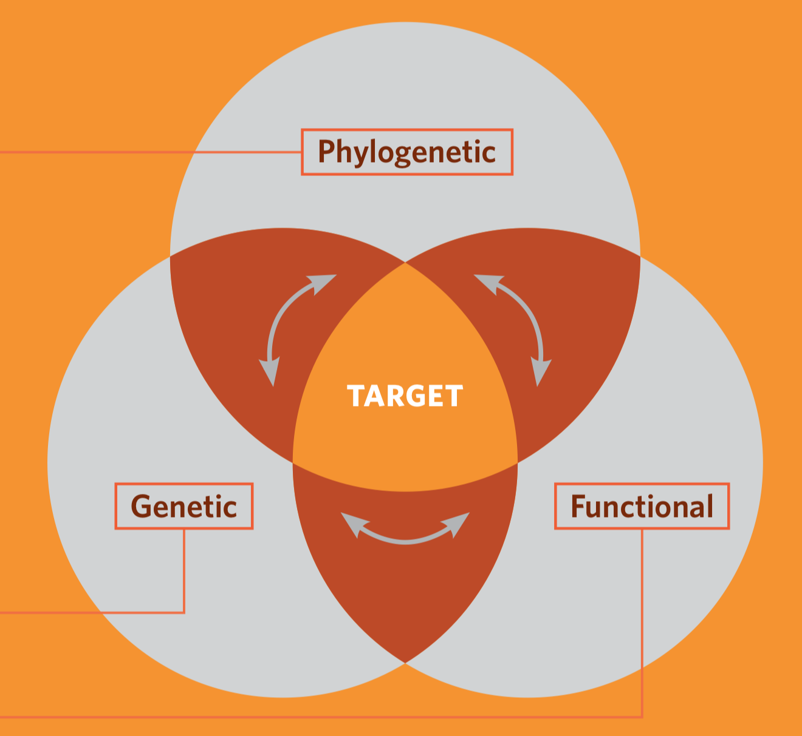
]

.pull-right[
- In the 1990's conservation biologists recognized the *biodiversity* is not only species diversity

    - Biodiversity has several axes or dimensions including genetic, taxonomic, phylogenetic and functional diversity
]

---

# Phylodiversity

.footnote[
[1] Faith D.P. (1992) Conservation evaluation and phylogenetic diversity. Biological Conservation, 61, 1-10.
]

- Phylogenetic diversity was first formalized by Dan Faith in 1992

    - He proposed a metic called PD that is also commonly referred to as Faith's
      Index
    - Many additional metics have now been generated but this metic is still
      widely used, especially in the context of conservation

---

# Faith's Index (PD)

```{r, echo = F}

my_samp <- rep(1, 6) %>% as.matrix %>% t
colnames(my_samp) <- names(aa)
rownames(my_samp) <- "site1"
total_pd <- pd(my_samp, t)[1,1]

```


.pull-left[

```{r, echo = FALSE, fig.retina = 3}

plot(t,
   show.tip.label = FALSE,
   direction = "rightwards")

edgelabels(t$edge.length,
           adj = c(0.5, -0.5),
           frame = "none",
           bg = "white",
           col = "blue",
           font = 2)

```
]

.pull-right[
- PD is the sum of the lengths of all those branches that are members of the corresponding minimum spanning path
]

--

.pull-right[
- PD is the phylogenetic analogue of taxon richness and is expressed as the number of tree units which are found in a sample
]

--

.pull-right[
- PD will correlate with species richness
]

--

.pull-right[
- Total branch length = `r total_pd`
]

---

# Faith's Index (PD)

```{r, echo = F}
my_samp1 <- my_samp
my_samp1[, 4:6] <- 0
pd1 <- pd(my_samp1, t)[1,1]
```

.pull-left[

```{r, echo = FALSE, fig.retina = 3}
plot(t,
   show.tip.label = FALSE,
   direction = "rightwards")

edgelabels(t$edge.length,
           adj = c(0.5, -0.5),
           frame = "none",
           bg = "white",
           col = "blue",
           font = 2)

#tiplabels(t2$tip.label,
tiplabels(
          pch = 21,
          cex = 4,
          col = NA,
          bg = rep(c("blue", NA), each = 3))
```
]

--

.pull-right[
- Total branch length = `r pd1`

]

---

# Faith's Index (PD)

```{r, echo = F}
my_samp2 <- my_samp
my_samp2[, c(2, 4, 6)] <- 0
pd2 <- pd(my_samp2, t)[1,1]
```

.pull-left[
```{r, echo = FALSE, fig.retina = 3}
plot(t,
   show.tip.label = FALSE,
   direction = "rightwards")

edgelabels(t$edge.length,
           adj = c(0.5, -0.5),
           frame = "none",
           bg = "white",
           col = "blue",
           font = 2)

#tiplabels(t2$tip.label,
tiplabels(
          pch = 21,
          cex = 4,
          col = NA,
          bg = rep(c("blue", NA), 3))
```
]

--

.pull-right[
- Total branch length = `r pd2`
]


---

# Pethcey's functional diversity (FD)


.footnote[
[1] Petchey, O. L. & Gaston, K. J. Functional diversity (FD), species richness and community composition. Ecology Letters 5, 402–411 (2002).
]

.pull-left[
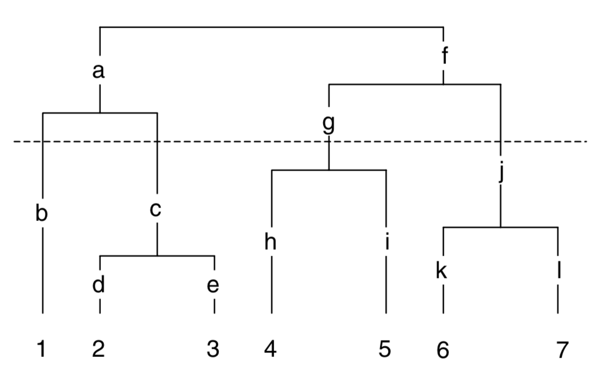
]

.pull-right[
- FD is proposed by Owen Petchey in 2002
]

--

.pull-right[
- FD is the total branch length of the functional dendrogram.
]

--

.pull-right[
- Analogous to PD
]

---

# Beyond Faith's Index (PD)

.footnote[
[1] Webb, C.O., 2000. Exploring the Phylogenetic Structure of Ecological Communities: An Example for Rain Forest Trees. The American Naturalist 156, 145–155. https://doi.org/10.1086/303378
]

- Solution for genus:species = Use phylogenetic trees to estimate the
  relatedness of coexisting species

    - This solution was first proposed by Cam Webb in 2000

--

.pull-left[

```{r, fig.width =4, fig.height=4.5}

aa2 <- c(1, 3, 5, 9, 11, 13)
names(aa2) <- c("E", "F", "D", "B", "A", "C")

t2 <- aa2 %>%
  dist %>%
  hclust %>%
  as.phylo

plot(t2,
   show.tip.label = FALSE,
   direction = "rightwards",
   main = "Community phylogeny")

tiplabels(t2$tip.label,
          cex = 2,
          frame = "none")

```

]

--

.pull-right[

Distance matrix

```{r}
tmp <- rep(1, 6)
names(tmp) <- LETTERS[1:6]
dist_all <- tmp %>% dist
dist_all[1:15] <- c(1, 2, 4, 5, 5,
                    2, 4, 5, 5,
                    3, 4, 4,
                    2, 2,
                    1)
mat_all <- dist_all %>% as.matrix

dist_all
```
]

---
name:mpd

# Mean Pairwise Distance (MPD) and Net Related Index (NRI)

.footnote[
[1] $MPD = \frac{1}{n} \Sigma^n_i \Sigma^n_j \delta_{i,j} \; i \neq j$, where
$\delta_{i, j}$ is the pairwised distance between species *i* and *j*
]

Greatest possible mean pairwise node distance for a community of 4 taxa = 22 /4 = 3.66 (for A, B, E, F)

--

.pull-left[

Community 1; A, B, C, D

```{r}
dist1 <- mat_all[LETTERS[1:4], LETTERS[1:4]] %>% as.dist
dist1
```

Mean pairwise nodal distance (**MPD**) = (1 + 2 + 2 + 4 + 4 + 3) / 6 = 2.66

Net Related Index (**NRI**) = 1 - (2.66 / 3.66) = 0.273

]

--

.pull-right[

Community 2; A, B, E, F

```{r}
dist2 <- mat_all[c("A", "B", "E", "F"), c("A", "B", "E", "F")]  %>% as.dist
dist2
```

Mean pairwise nodal distance (**MPD**) = (1 + 5 + 5 + 5 + 5 + 1) / 6 = 3.66

Net Related Index (**NRI**) = 1 - (3.66 / 3.66) = 0

]


---
name:mntd

# Mean Nearest Nodal Distance (MNTD) and Nearest Taxa Index (NTI)

.footnote[
[1] $MNTD = \frac{1}{n} \Sigma^n_i min \delta_{i,j} \; i \neq j$, where $min \delta_{i, j}$ is the minimum distance between species *i* and all other species in the community.
]

Greatest possible nearest nodel distance for a community of 4 taxa = 2 (for A, C, D, F)

(A to C = 2, C to A = 2, E to F = 2, F to E = 2)

```{r}
dist3 <- mat_all[c("A", "C", "D", "F"), c("A", "C", "D", "F")]  %>% as.dist
```

.pull-left[

Community 1; A, B, C, D

```{r}
dist1
```

Mean nearest nodal distance (**MNTD**) = (1 + 1 + 2 + 3) / 4 = 1.75

Nearest Taxa Index (**NTI**) = 1 - (1.75 / 2.0) = 0.125

]

--

.pull-right[

Community 2; A, B, E, F

```{r}
dist2 <- mat_all[c("A", "B", "E", "F"), c("A", "B", "E", "F")]  %>% as.dist
dist2
```

Mean nearest nodal distance (**MNTD**) = (1 + 1 + 1 + 1) / 4 = 1

Nearest Taxa Index (**NTI**) = 1 - (1 / 2.0) = 0.5

]

---

class:middle, center

# Sparks community phylogeny

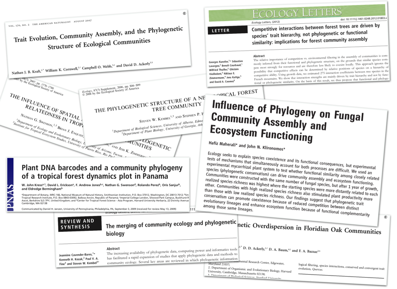
---

name:Losos1


.footnote[
[1] https://en.wikipedia.org/wiki/Anolis_ecomorphs
]

.pull-left[

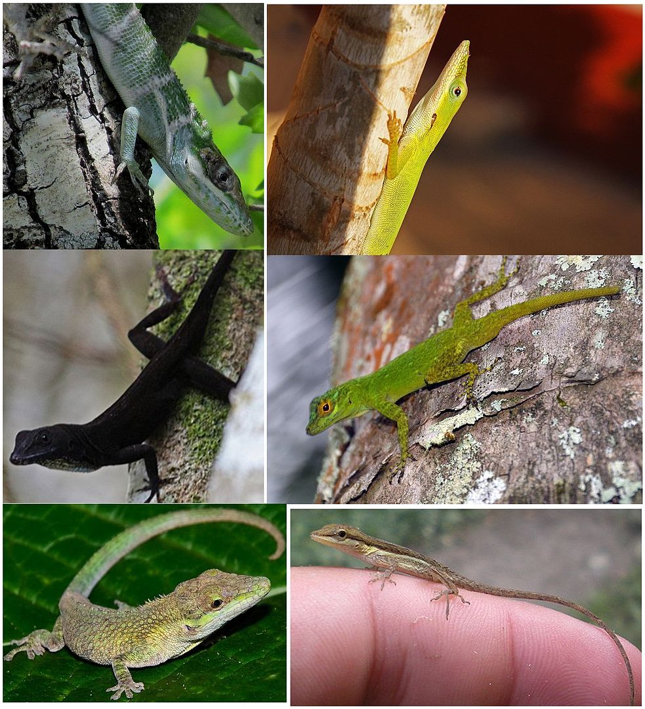

]

.pull-right[
- We are assuming that related species are ecologically similar
]
--

.pull-right[
- Related species can have very different traits
]


---

name:Losos2

.pull-left[
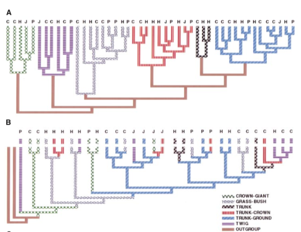
]


.pull-right[

## A: Functional dendrogram based on ecomorph

## B: Phylogeny indicates frequent evolution of traits

]

.footnote[
[1] Losos, J. B., Jackman, T. R., Larson, A., De Queiroz, K. & Rodríguez-Schettino, L. Contingency and determinism in replicated adaptive radiations of island lizards. Science 279, 2115–2118 (1998).
]

---

# Putting traits on the tips of phylogeny: phylogenetic signal

.footnote[
[1] Blomberg, S. P., T. Garland Jr., A. R. Ives (2003) Testing for phylogenetic signal in comparative data: Behavioral traits are more labile. Evolution, 57, 717-745.
]

.pull-left[
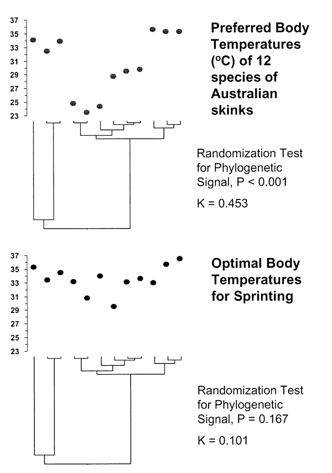
]

--

.pull-right[
- Phylogenetic signal (K) quantifies if the focal traits were inherited from their recent or old common ancestor
]

--

.pull-right[
- Large K indicates phylogenetic coservatism and small K indicates phylogenetic divergence
]

--

.pull-right[
- (Phylogenetic signal (K): the ratio of the mean squared error of the tip data measured from the phylogneitic corrected mean nd the mean squared error based on the variance–covariance matrix derived from the given phylogeny under the assumption of Brownian motion)
]


---

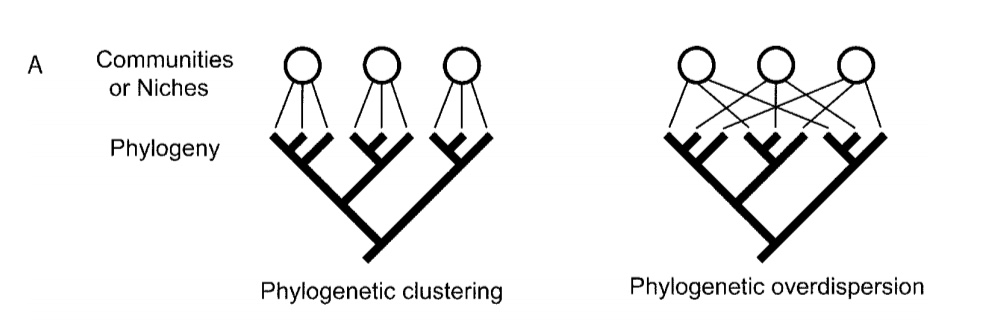


.footnote[
[1] Cavender‐Bares, J., Ackerly, D. D., Baum, D. A. & Bazzaz, F. A. Phylogenetic Overdispersion in Floridian Oak Communities. The American Naturalist 163, 823–843 (2004).
]

---

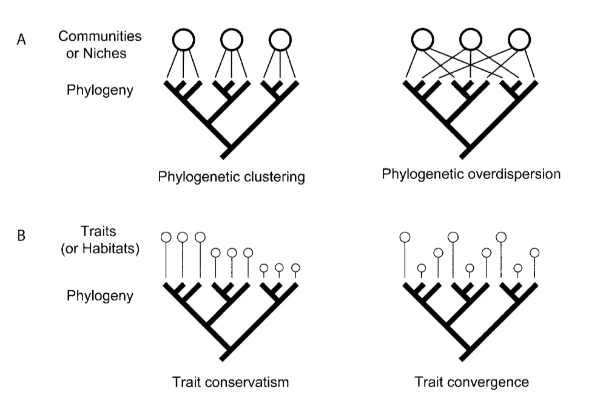

---

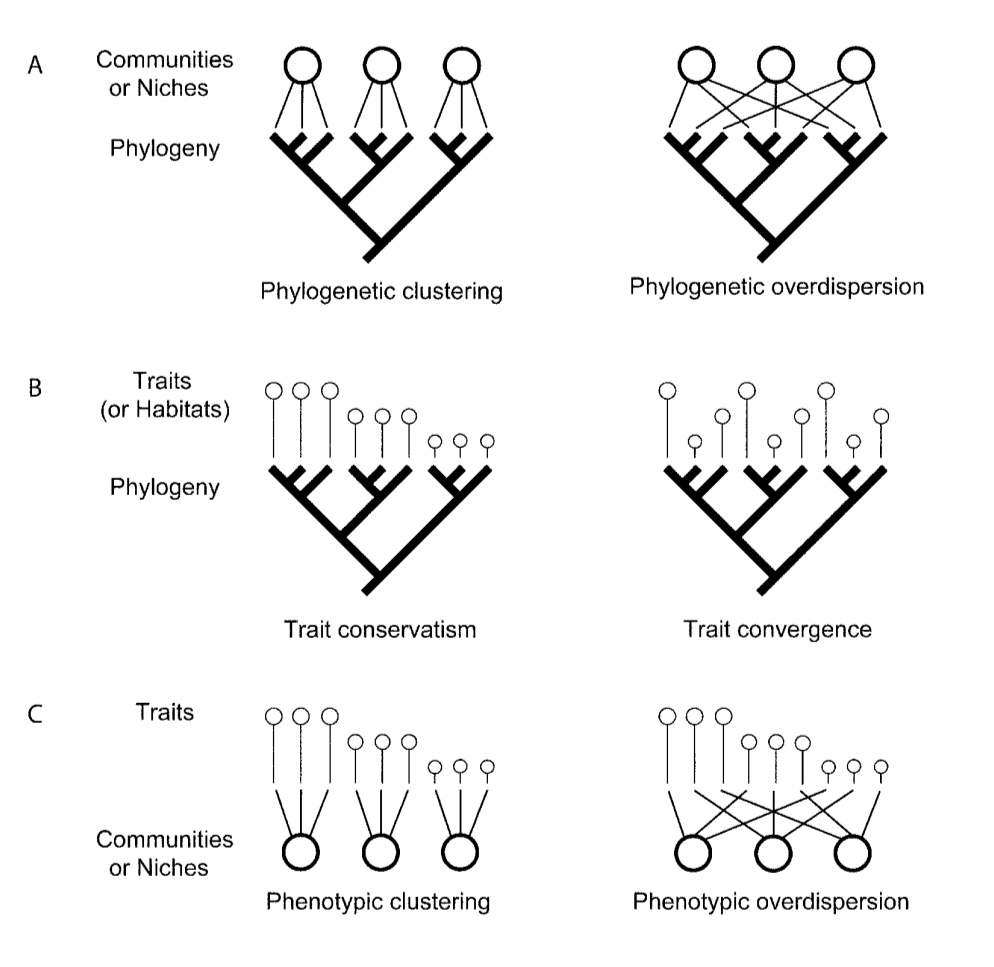

---

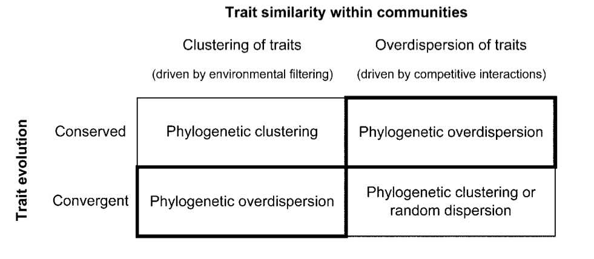

.footnote[
[1] Cavender‐Bares, J., Ackerly, D. D., Baum, D. A. & Bazzaz, F. A. Phylogenetic Overdispersion in Floridian Oak Communities. The American Naturalist 163, 823–843 (2004).
]

---

.footnote[
[1] Swenson, N. G. The assembly of tropical tree communities - the advances and shortcomings of phylogenetic and functional trait analyses. Ecography 36, 264–276 (2013).
]

.pull-left[
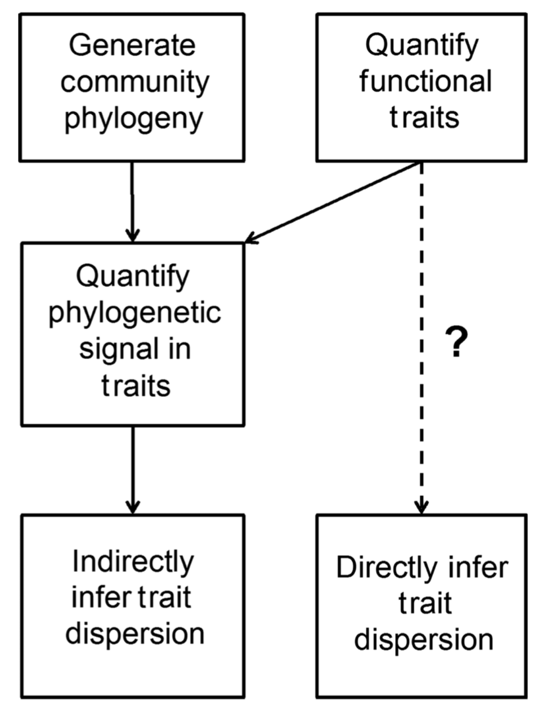
]

.pull-right[
- Phylogeny as a proxy for the functional or ecological similarity of species.
]

--

.pull-right[
- Measuring trait data and arraying it on the phylogenetic tree to demonstrate phylogenetic signal in function so that their phylogenetically-based inferences could be supported.
]

--

.pull-right[
- Compared to simply measuring the trait dispersion, this approach is very indirect.
]

--

.pull-right[
- This approach should be avoided! (phylogeny and traits are useful to make meaningful evolutionary inferences)
]


---

# Plant functional traits

Measurable properties of plants that are indicative of ecological strategies

.pull-left[

"Hard" traits: e.g., Photosynthetic rates


]

--

.pull-right[

"Soft" traits: e.g., LMA (leaf mass per area)


]

---

# Leaf Economic Spectrum (LES)

.right-column[
.footnote[
[1] Reich, P. B., Walters, M. B. & Ellsworth, D. S. From tropics to tundra: Global convergence in plant functioning. Proceedings of the National Academy of Sciences 94, 13730–13734 (1997).

[2] Wright, I. J., P. B. Reich, M. Westoby et al. The worldwide leaf economics spectrum. Nature 428, 821–827 (2004).
]
]

.left-column[
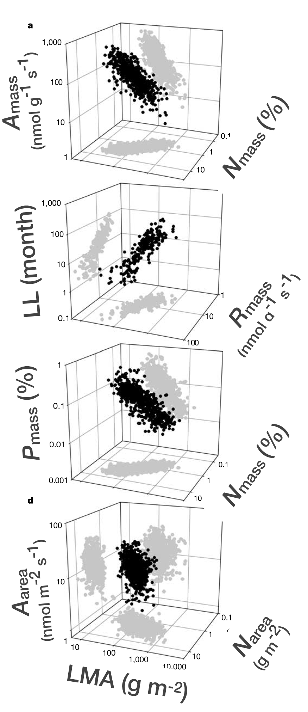
]

.right-column[
- LES describes pairwise correlations among a bunch of leaf traits from the global leaf database called GLOPNET
]

--

.right-column[
- Peter Reich first formulated the idea of LES
]

--

.right-column[
- Peter Reich, Ian Wright, Mark Westoby and other people confirmed the generality of the LES
]

--

.right-column[
- Global leaf function constrained to a single axis (75 % of variation in the 6 traits)
]

---


# Rebuilding community ecology from functional traits

- Non-trait based statement

   - *Campanula aparinoides* is found only in infertile habitats.

--

- Trait-based statement

   - Compact plants with canopy area < 30 cm <sup>2</sup>  and small or absent leaves are restricted to marshes with < 18 $\mu$ g g <sup>-1</sup> soil P.

.footnote[
[1] McGill, B. J., Enquist, B. J., Weiher, E. & Westoby, M. Rebuilding community ecology from functional traits. Trends in Ecology and Evolution 21, 178–185 (2006).
]

---


class: middle

.footnote[
[1] McGill, B. J., Enquist, B. J., Weiher, E. & Westoby, M. Rebuilding community ecology from functional traits. Trends in Ecology and Evolution 21, 178–185 (2006).
]


# Rebuilding community ecology from functional traits

--

- Go beyond 'How many species and why?' to ask 'How much variation in traits and why?'

--

- Go beyond 'In what environments does a species occur?’ to ask 'What traits and environmental variables are most important in determining fundamental niche?'

--

- Go beyond 'What are the most important niche dimensions?' to ask 'What traits are most decisive in translating from fundamental niche to realized niche?'

--

- Go beyond 'How does population dynamics determine abundance?' to ask 'How does the performance of species in the interaction milieu determine their ranking of abundance or biomass?'

--

- Go beyond 'How does space affect population dynamics?' to ask 'How do environmental gradients affect community structuring?'


---

# Convex hull volume (functional richness)


.right-column[
.footnote[
[1] Cornwell, W. K., Schwilk, L. D. W. & Ackerly, D. D. A trait-based test for habitat filtering: convex hull volume. Ecology 87, 1465–71 (2006).
]]

.left-column[
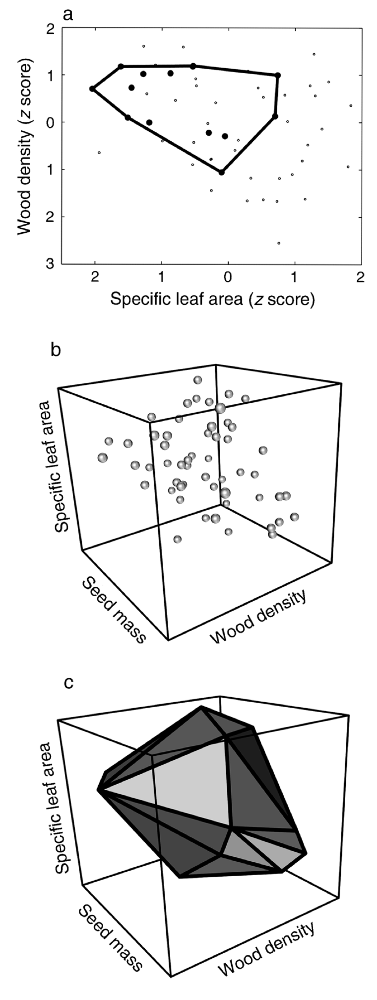

]

.right-column[
- California woody-plant communities (43 plot, 54 species, 3 traits)
]

--

.right-column[
- Is trait volume of California woody-plant communities significantly less than expected by chance?
    - Environmental filtering
]

---


# Convex hull volume (functional richness)

.footnote[
[1] Cornwell, W. K., Schwilk, L. D. W. & Ackerly, D. D. A trait-based test for habitat filtering: convex hull volume. Ecology 87, 1465–71 (2006).
]

.pull-left[
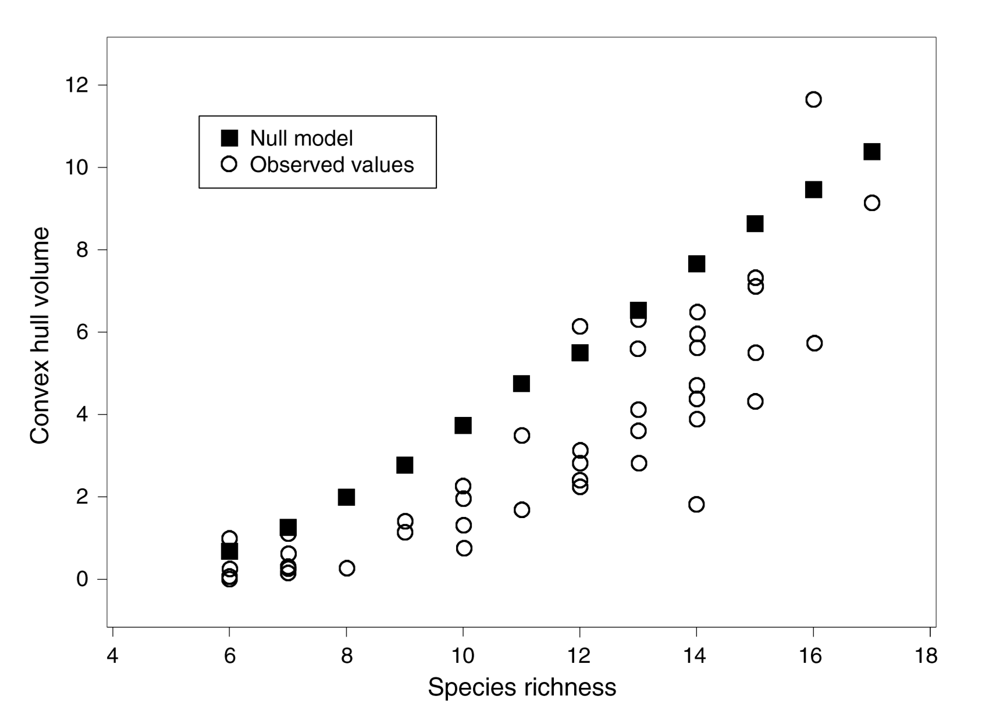
]

.pull-right[

- Species in 40 out of 43 plots occupied less trait space than would be expected by chance

     - Consistent with environmental filtering


]


---

class:center

# Community assembly and trait distribution

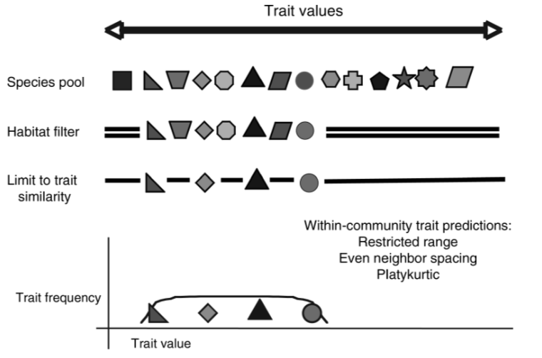

.footnote[

[1] Cornwell, W. K. & Ackerly, D. D. Community assembly and shifts in plant trait distributions across an environmental gradient in coastal California. Ecological Monographs 79, 109–126 (2009).

]


---

#  Environmental filtering and limiting similarity can occur at the same time

.footnote[
[1] Kraft, N. J. B., Valencia, R. & Ackerly, D. D. Functional Traits and Niche-Based Tree Community Assembly in an Amazonian Forest. Science 322, 580–582 (2008).
]

.pull-left[
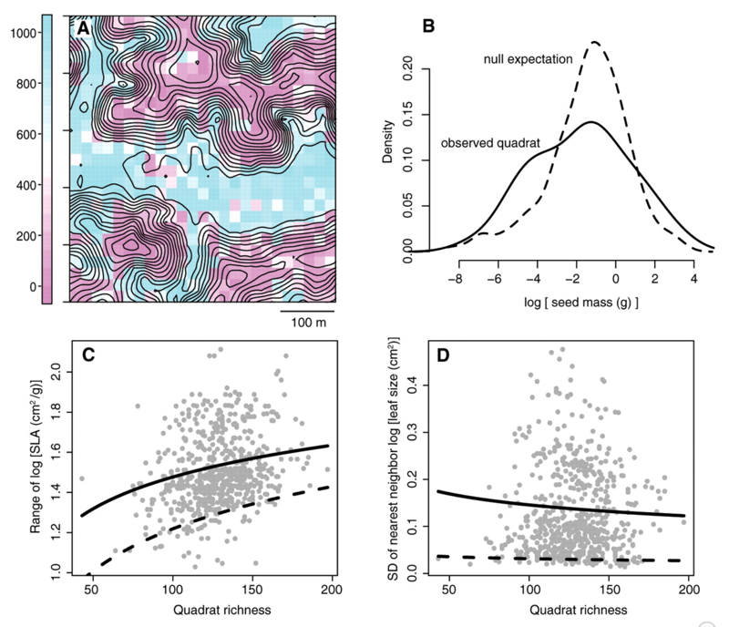
]

.pull-right[
- Yasuni topical tree communities, 25ha, 625 20m x 20m quadrats, 1089 species!
]

--

.pull-right[
- A: Ridgetops have lower than expected SLA and valleys have higher
    - Traits match with environment conditions
]

--

.pull-right[
- B: Seed masse shows broader distribution than expected
    - Limiting similarity
]

--

.pull-right[
- C: Range of SLA is smaller than expected  
    - Environmental filtering
]

--

.pull-right[
- D: SD of nearest-neighbor distances for leaf size
    - Limiting similarity
]

---

# Competitive hierarchy

.footnote[
[1] $t_A$ and $t_B$ are the functional traits values of species A and B

[2] Kunstler, G. et al. Competitive interactions between forest trees are driven by species’ trait hierarchy, not phylogenetic or functional similarity: Implications for forest community assembly. Ecology Letters 15, 831–840 (2012).
]

.pull-left[

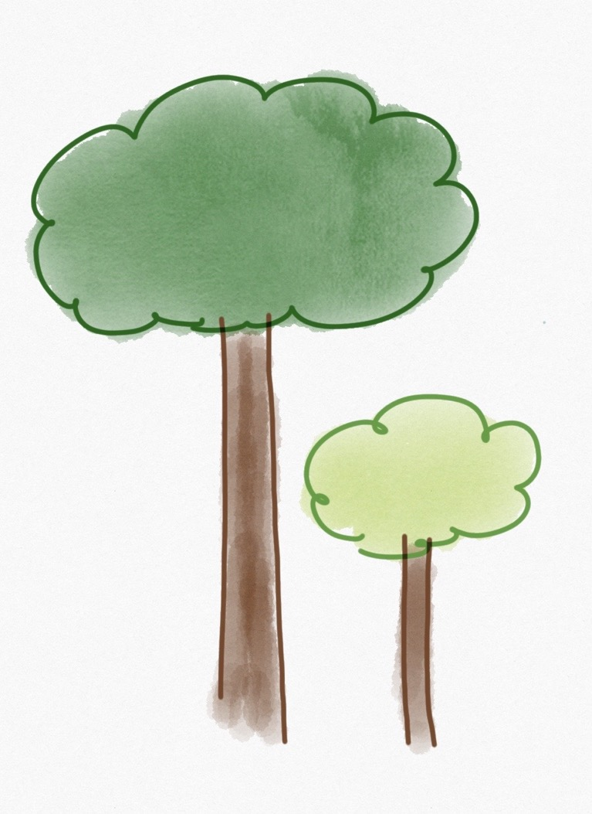

## Limiting similarity

Competitive interaction strengths between species will increase with decreasing niche distance, measured as their absolute traits distance $|t_A - t_B|$

]

--


.pull-right[

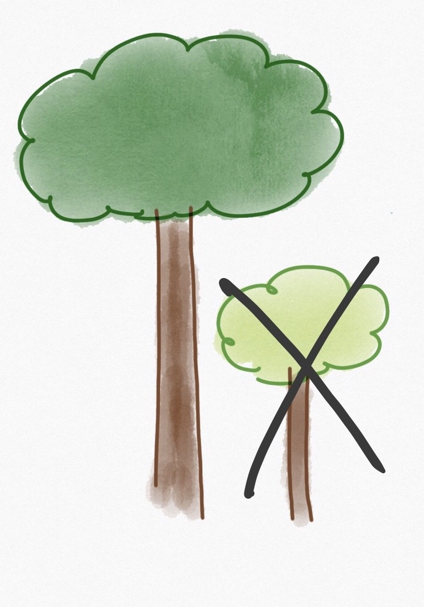

## Competitive hierarchy

Competitive effect of species A on species B will increase with increasing $t_A - t_B$.

]

---

# Summary `r emo::ji("beer")`


- Why do we use trait and phylogenetic diversity?

  - We want to quantify ecological similarities of species and multiple dimension of
    biodiversity
--

- Trait-based approaches

  - They will make "ecology" more quantitative and predictive

--

- How to calculate trait and phylogenetic diversity?

  - I hope you remember it!
